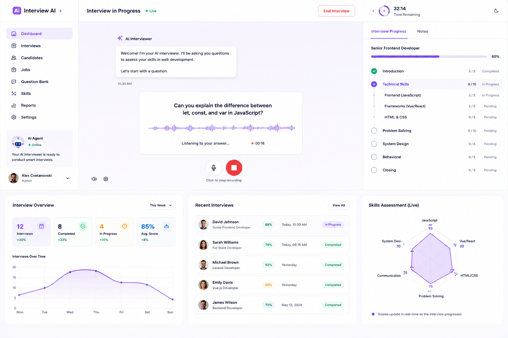

# Interview AI

An AI-powered interview assistant that conducts adaptive technical interviews, evaluates candidate responses in real-time, and generates comprehensive hiring reports.

<p align="center">
  
</p>

## Overview

Interview AI automates the technical screening process by:

- Generating targeted questions based on position requirements
- Dynamically adjusting difficulty based on candidate responses
- Providing follow-up questions for weak answers
- Scoring skills and producing candidate comparison reports
- Recommending or shortlisting candidates based on performance

## Interview Flow

```
Candidate
    │
    ▼
Start Interview
    │
    ▼
Interviewing
    │
    ▼
Ask Question
    │
    ▼
Candidate Answers
    │
    ▼
Assess Answer
    │
    ├───────────────┐
    │               │
    ▼               ▼
Strong            Weak
    │               │
    │               ▼
    │         Generate Follow-up
    │               │
    └───────┬───────┘
            ▼
       Next Question
            │
            ▼
       More Questions?
        /          \
      Yes           No
       │             │
       └──────┐      ▼
              │   Complete
              │      │
              ▼      ▼
           Interview Report
```

## Tech Stack

| Layer | Technology |
|-------|------------|
| **Backend** | Laravel 13 / PHP 8.3+ |
| **Frontend** | Vue 3 + Inertia.js v3 |
| **Authentication** | Laravel Fortify + Passkeys |
| **Routing** | Laravel Wayfinder |
| **Styling** | Tailwind CSS v4 |
| **Testing** | Pest 5 |
| **Database** | SQLite (default) |

## Requirements

- PHP 8.3+
- Node.js 20+
- Composer

## Installation

```bash
composer setup
```

This runs `composer install`, sets up `.env`, generates an app key, runs migrations, installs npm dependencies, and builds assets.

## Development

```bash
composer dev
```

Runs the Laravel dev server, Vite, and any other watchers concurrently.

## Testing

```bash
composer test
```

Runs linting (Pint), static analysis (PHPStan), and Pest tests.

To run only tests:

```bash
php artisan test --compact
```

## Project Structure

```
app/
├── Identity/          # Authentication, authorization, organizations
├── Candidates/        # Candidate registration, resume uploads
├── Positions/         # Position and skill management
├── Interviewing/      # Interview lifecycle (start, pause, resume, complete)
├── Assessments/       # Answer evaluation and scoring
├── QuestionBank/      # Question generation and management
├── Reporting/         # Report generation and candidate comparison
├── Hiring/            # Shortlisting and recommendations
├── AI/                # AI interviewer, question generator, answer evaluator
└── Shared/            # Bus, value objects, exceptions, support utilities
```

## License

MIT
